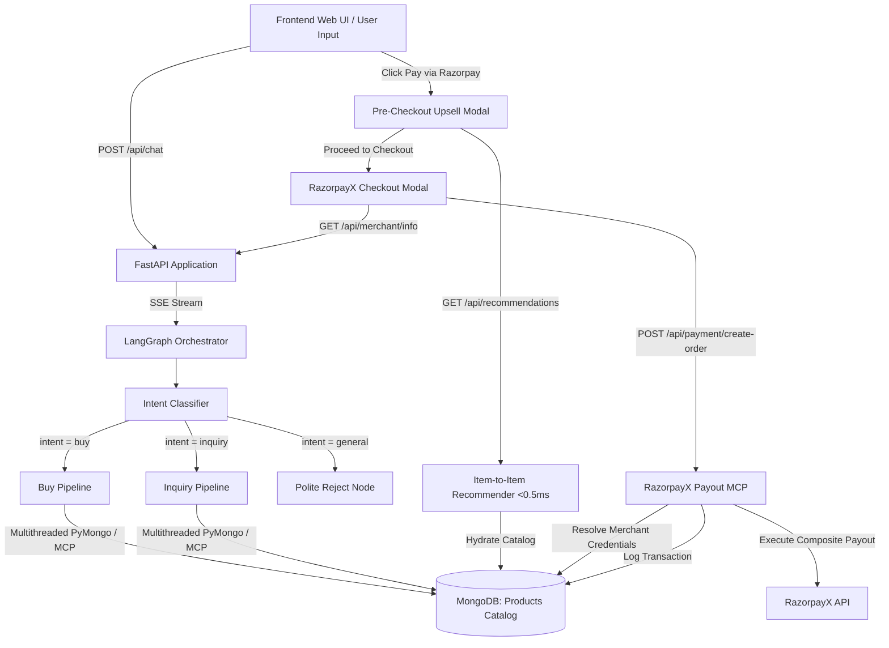

# 🛍️ ShopSmart AI — Agentic E-Commerce & RazorpayX Payout System

> An end-to-end agentic e-commerce shopping assistant built with **LangGraph**, **FastAPI**, **Google Gemini AI**, **High-Performance MongoDB MCP Connector**, and **RazorpayX Composite Payout API**. Featuring real-time intent routing, multithreaded fast-path database execution, deterministic rate-limit fallbacks, dynamic merchant bank resolution, and a luxury obsidian dark-mode web UI.

---

## 🌟 Key Features

* **🤖 Multi-Agent LangGraph Pipeline**: Intelligent multi-turn routing across `intent_classifier`, `buy_pipeline`, `inquiry_pipeline`, and `polite_reject` nodes.
* **⚡ Sub-Millisecond Recommendation Engine**: High-throughput Item-to-Item recommendation system (`< 0.5 ms` SLA) backed by precomputed co-occurrence matrices and MongoDB catalog hydration.
* **🛍️ Pre-Checkout "Frequently Bought Together" Upsell**: Interactive pre-payment modal that presents personalized add-ons with direct "Add to Order" options before finalizing Razorpay payments.
* **⚡ High-Performance Multithreaded Database MCP**: `mongodb_connector.py` powered by a dedicated `ThreadPoolExecutor` fast-path executing sub-5ms PyMongo queries with full stdio MCP protocol fallback.
* **🛡️ Deterministic Rate-Limit Resilience**: Fallback keyword/regex extractors, multi-tier search logic, and default intro formatting that keep the pipeline 100% continuous during LLM rate limits (`429 RESOURCE_EXHAUSTED`).
* **🏦 Dynamic RazorpayX Vendor Payouts**: Real-time resolution of merchant banking details (Account Number, IFSC, Merchant Name, Email, Phone) from MongoDB `Merchant_Info` collections to trigger automated IMPS payouts.
* **💳 Complete Merchant Payout Summary**: Detailed transaction cards displaying complete merchant credentials, order title, INR amount, Payout ID, UTR, and status upon payment completion.
* **📊 Full-Stack Observability & Audit Trail**: Structured logging across all pipeline nodes (`[NODE: intent_classifier]`, `[NODE: buy_pipeline]`, `[RECOMMENDATIONS API]`, `[RAZORPAY MCP]`, `[PAYMENT API]`).
* **🎨 Modern Obsidian & Metallic UI**: Luxury dark-mode theme with white typography, vibrant brand accents, real-time SSE token streaming, and an authentic **RazorpayX Checkout Modal**.
* **📈 Offline Evaluation Suite**: Integrated `DeepEval` testing framework with CSV-formatted golden datasets (`evals/golden_dataset/`).

---

## 🏗️ Architecture & Pipeline Flow



---

## 🤖 LLM Model Tiering Architecture

To optimize responsiveness, accuracy, and API quota usage, tasks are tiered by complexity across Google Gemini models (`GOOGLE_API_KEY`):

| Task Tier | Model | Pipeline Component |
|---|---|---|
| **Lite** | `gemini-3.5-flash-lite` | Intent classification, MongoDB MQL generation |
| **Balanced** | `gemini-3.6-flash` | Preference extraction, general fallback handling |
| **Pro** | `gemini-3.7-flash` | Product reranking, detailed inquiry Q&A response generation |

---

## 📁 Repository Structure

```
Razorpay_Demo/
├── backend/
│   ├── app.py                      # FastAPI web server, recommendation & payment endpoints
│   ├── main.py                     # LangGraph state machine & thread checkpointer
│   ├── agents/
│   │   ├── state.py                # TypedDict shared state definition (ChatState)
│   │   ├── intent.py               # Intent classifier node (LLM + Regex Fallback)
│   │   ├── buy.py                  # Product preference gatherer, query generator, executor & reranker
│   │   ├── inquery.py              # Product inquiry resolver node
│   │   ├── reject.py               # Out-of-domain & order confirmation handler
│   │   └── llm.py                  # Gemini LLM tiering configuration
│   └── mcp/
│       ├── database/
│       │   └── mongodb_connector.py # Multithreaded fast-path PyMongo + stdio MCP client
│       └── payment/
│           └── razorpay_mcp.py     # RazorpayX payout connector & merchant bank resolver
├── recommendation_engine/
│   ├── model/
│   │   ├── recommender.py          # Sub-millisecond Item-to-Item recommender module
│   │   ├── train_model.py          # Co-occurrence index training script
│   │   └── model_artifacts.pkl     # Pre-computed lookup index
│   └── dataset/
│       └── raw_transactions.csv    # Market basket transactions dataset
├── frontend/
│   ├── index.html                  # Main web interface
│   ├── style.css                   # Luxury obsidian black & grey design system
│   └── app.js                      # Pre-checkout recommendation modal, streaming, & Razorpay UI
├── evals/
│   ├── golden_dataset/             # CSV evaluation benchmark datasets
│   ├── evals_pipelines/            # DeepEval automated test runners
│   └── conftest.py                 # Pytest fixtures & dataset loaders
├── requirements.txt                # Python dependencies
└── README.md                       # Project documentation
```

---

## 🚀 Quickstart Guide

### 1. Environment Setup

Clone the repository and set up a Python 3.12+ virtual environment:

```bash
python3 -m venv .venv
source .venv/bin/activate
pip install -r requirements.txt
```

### 2. Environment Variables

Create a `.env` file in the root directory:

```env
GOOGLE_API_KEY=your_gemini_api_key
MDB_MCP_CONNECTION_STRING=your_mongodb_connection_string
MONGODB_DATABASE=Merchant_1
RAZORPAY_KEY_ID=your_razorpay_key_id
RAZORPAY_KEY_SECRET=your_razorpay_key_secret
RAZORPAY_ACCOUNT_NUMBER=your_razorpay_account_number
```

### 3. Running the Server

Start the FastAPI application with Uvicorn:

```bash
.venv/bin/python -m uvicorn backend.app:app --reload --port 8000
```

Access the application in your browser:
* **Web UI**: `http://localhost:8000`
* **API Documentation**: `http://localhost:8000/docs`

---

## 💳 RazorpayX Vendor Payout Workflow

1. **Product Recommendation**: Products returned from MongoDB catalog queries carry associated `merchant_id` metadata.
2. **Merchant Detail Resolution**: When a user clicks **Proceed to Checkout**, the frontend queries `/api/merchant/info?merchant_id=...`. The backend dynamically fetches the merchant's business name, bank account number, IFSC code, email, and phone from the `Merchant_Info` collection.
3. **RazorpayX Checkout Modal**: An authentic RazorpayX interface renders beneficiary credentials, product title, and INR amount.
4. **Payout Execution**: Clicking **Pay via Razorpay** triggers `/api/payment/create-order`, invoking `RazorpayMCPConnector.create_payout()` to execute an instant IMPS transfer via RazorpayX APIs.
5. **Sanitized Narration**: Narration text is automatically sanitized and truncated to max 30 alphanumeric characters (`clean_narration`), satisfying Razorpay API constraints.
6. **Detailed Payout Summary**: Payment completion renders a comprehensive card displaying product title, transferred amount (₹), Payout ID, UTR, status, merchant name, account number, IFSC code, email, and phone.

---

## 🧪 Evaluation Pipeline

Run automated offline evaluation metrics using `DeepEval` and `pytest`:

```bash
pytest evals/evals_pipelines/ -v
```

---

## 🛡️ License

Built for Demonstration & Development — ShopSmart AI Pipeline.
